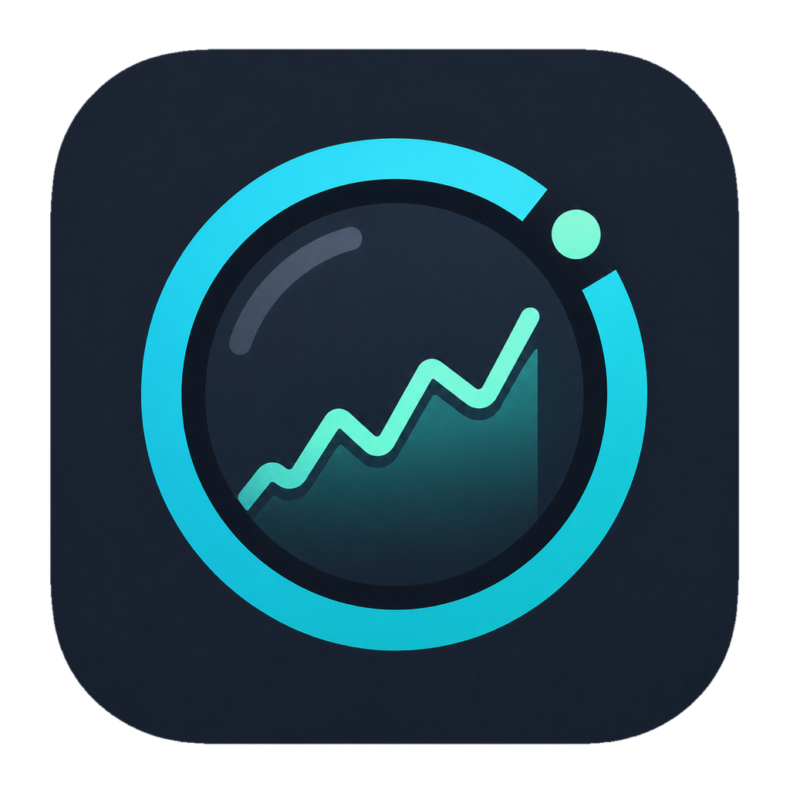
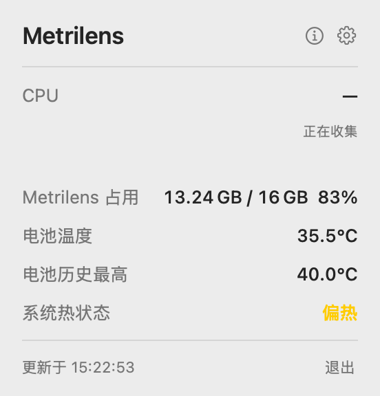

<p align="center">
  
</p>

# Metrilens

Metrilens 是一个仅支持 Apple Silicon、常驻 macOS 菜单栏的轻量系统状态查看器。

[更新日志](CHANGELOG.md) · [发布与安装验收清单](docs/release-checklist.md)

<p align="center">
  
</p>

它显示：

- CPU 总占用、最近 10 分钟折线、最近 60 秒平均值和峰值
- “内存占用”口径的内存使用量、最近 10 分钟折线、最近 60 秒平均值和峰值
- AppleSmartBattery 电池当前温度、会话最高温度与设备历史最高温度
- 电池电量、供电状态、循环次数，以及 macOS 提供可识别值时的电池健康状态
- 当前主网络接口的实时下载与上传速率
- 启动磁盘的容量、已用与可用空间
- macOS 系统热状态
- 异常发热迹象、判断依据和可执行的降温建议

它不会主动联网、不扫描进程、不启动外部采集进程、不请求管理员权限，也不承诺 CPU/GPU 精确摄氏温度。网络速率只读取当前主接口的系统累计计数，不会发起网络请求；刷新频率默认为 1 秒，也可选择 2、5、10 或 30 秒。

菜单栏可显示单个指标或自选的紧凑指标组合，并可调整指标顺序、分隔符与数值精度。界面支持跟随系统、简体中文和 English；温度及系统热状态按严重程度使用系统语义色。CPU、内存、系统热状态、低电量、电池高温和磁盘空间提醒分别设有开关，提醒总开关默认关闭；设置页可检查权限、发送测试提醒或打开系统通知设置。应用位于前台时也会显示横幅并播放提示音。

弹窗提供“系统原生”“深海监测”“机舱琥珀”三套预设样式，可在“设置 → 显示”中切换并即时预览。样式只改变色彩和界面层级，不改变告警的系统语义色。

异常发热诊断只复用现有轻量指标：系统热状态、CPU 当前/60 秒汇总、电池温度与充电状态。它不会为了找“元凶”扫描进程；出现 CPU 相关迹象时会建议用户在“活动监视器”中确认具体 App。

## 安装

要求 macOS 13 或更高版本和 Apple Silicon Mac。

1. 从 [GitHub Releases](https://github.com/zxftssr/metrilens/releases) 下载 `Metrilens-vX.Y.Z-macos-arm64.zip` 与对应的 `.sha256` 文件。
2. 在终端进入下载目录并校验文件：

   ```bash
   shasum -a 256 -c Metrilens-vX.Y.Z-macos-arm64.zip.sha256
   ```

3. 解压后把 `Metrilens.app` 拖入“应用程序”。
4. 当前版本使用本地 ad-hoc 签名且未经 Apple 公证。校验 SHA-256 并确认下载来源可信后，先尝试打开一次；若 macOS 阻止启动，请前往“系统设置 → 隐私与安全性”，在“安全性”区域点按“打开”，再选择“仍要打开”并输入登录密码。该按钮仅在尝试打开 App 后约一小时内出现；较早版本的 macOS 也可在访达中按住 Control 点击 App 后选择“打开”。详见 [Apple 官方说明](https://support.apple.com/zh-cn/guide/mac-help/mh40617/mac)。

登录启动、界面语言、菜单栏显示模式/顺序/格式、刷新频率、CPU/内存折线和各类本地提醒均可在分组设置中调整。设置损坏时 App 会自动恢复安全默认值；也可在设置窗口底部选择“恢复默认设置…”。

## 关于、诊断与快捷键

状态弹窗右上角的 ⓘ 打开“关于 Metrilens”。“复制诊断信息”或“保存诊断报告…”只输出以下白名单内容：

- App 版本与构建号
- macOS 版本、arm64 架构和低电量模式状态
- Metrilens 的显示、刷新和提醒设置
- 采样器运行状态与各指标实际周期
- CPU、内存、电池、网络、磁盘、60 秒统计、系统热状态和发热诊断代码
- 最近 5 条去重后的指标读取错误

不会复制用户名、主机名、设备序列号、文件路径、IP 地址或进程 ID。

常用键盘操作：

- `⌘I`：关于与诊断
- `⌘,`：设置
- `⌘Q`：退出
- `⇧⌘C`：在“关于”窗口复制诊断信息

状态栏按钮、各指标、CPU 折线与所有设置控件均提供 VoiceOver 标签和值。

## 卸载

1. 从菜单栏弹窗退出 Metrilens。
2. 如果启用了登录启动，先在 Metrilens 设置或“系统设置 → 通用 → 登录项”中关闭。
3. 删除“应用程序”中的 `Metrilens.app`。
4. 如需同时删除偏好，可执行：

   ```bash
   defaults delete com.xfzhou.Metrilens
   ```

## 本地构建

要求 Xcode 16：

```bash
xcodebuild \
  -project Metrilens.xcodeproj \
  -scheme Metrilens \
  -configuration Debug \
  -destination 'platform=macOS,arch=arm64' \
  -derivedDataPath .build/DerivedData \
  CODE_SIGNING_ALLOWED=NO \
  build
```

运行本地 ad-hoc Release 构建及 smoke test：

```bash
./scripts/build_local_release.sh
```

产物位于 `.build/DerivedData/Build/Products/Release/Metrilens.app`。

## 测试与 CI

普通验证不需要管理员权限，也不运行耗时的轻量化性能门禁：

```bash
./scripts/static_constraints.sh
(cd scripts && python3 -m unittest test_measure_lightweight.py test_release_tools.py test_localization_catalog.py)
xcodebuild \
  -project Metrilens.xcodeproj \
  -scheme Metrilens \
  -configuration Debug \
  -destination 'platform=macOS,arch=arm64' \
  -derivedDataPath .build/DerivedData \
  CODE_SIGNING_ALLOWED=NO \
  test
./scripts/test_localizations.sh
./scripts/test_ui.sh
```

`test_localizations.sh` 校验集中式中英文文案目录并在两种语言环境下运行界面质量测试；`test_ui.sh` 启动真实 `XCUIApplication`，覆盖“菜单栏 → 弹窗 → 设置 → 切换 English”的端到端路径。XCUITest 需要当前 macOS 会话允许测试运行器启用 UI 自动化；若本机在测试方法执行前报告 `Timed out while enabling automation mode`，请在具备图形会话及自动化权限的环境重试。

GitHub Actions 在 Apple Silicon `macos-15` runner 上执行静态约束、Python 测试、Swift 测试、中英文界面测试、端到端 XCUITest、Release 构建及包结构验证；测试失败时上传 `xcresult`。发布 workflow 还会验证 tag 指向的提交就是实际构建提交。

完整轻量化门禁要求工作树无未提交修改，分标准与低电量两个场景，总计约 45 分钟，并需要 `fs_usage` 的管理员授权。只有在具备对应电源状态与时间条件时才运行：

```bash
sudo -v
./scripts/measure_lightweight.sh standard

# 保持接入电源并开启 macOS 低电量模式
sudo -v
./scripts/measure_lightweight.sh low-power
./scripts/measure_lightweight.sh finalize
```

详细测量窗口、原始结果完整性和门禁约束见 [设计方案](docs/design.md)。

## 发布

项目版本必须先在 Xcode 工程中更新为目标 `X.Y.Z`。本地构建确定性 ZIP、校验包结构并生成 SHA-256：

```bash
./scripts/release.sh X.Y.Z
```

产物位于 `.build/releases/vX.Y.Z/`。发布有两种入口：

- 推送 `vX.Y.Z` tag，由 GitHub Actions 自动验证、构建并创建 Release。
- 在干净工作树的目标提交上运行 `./scripts/release.sh X.Y.Z --publish`。本地脚本只创建并推送 tag；如果 tag 已存在但 Release 尚未完成，则只触发对应的 Actions workflow。

GitHub Actions 是 GitHub Release、草稿和资产的唯一写入者，并按 tag 串行执行，避免本地进程与 workflow 并发覆盖资产。发布脚本会验证源码版本、App 内版本、arm64 单架构、正式图标、App 包关键文件、ZIP 内结构和 SHA-256。相同 App bundle 会得到字节一致的 ZIP。

发布后必须从 GitHub Release 重新下载资产并执行[发布与安装验收清单](docs/release-checklist.md)，不能用本机发布目录中的 ZIP 代替远端产物验收。

可用一条命令下载并自动检查远端 Release 的 SHA-256、ZIP 结构、版本、arm64 架构、签名和 10 MiB 体积上限：

```bash
./scripts/accept_release.sh X.Y.Z
```

可选的 `--smoke` 会在隔离的临时副本上运行 3 秒启动检查；`--from-dir DIR` 可复验已经下载的两个资产。
